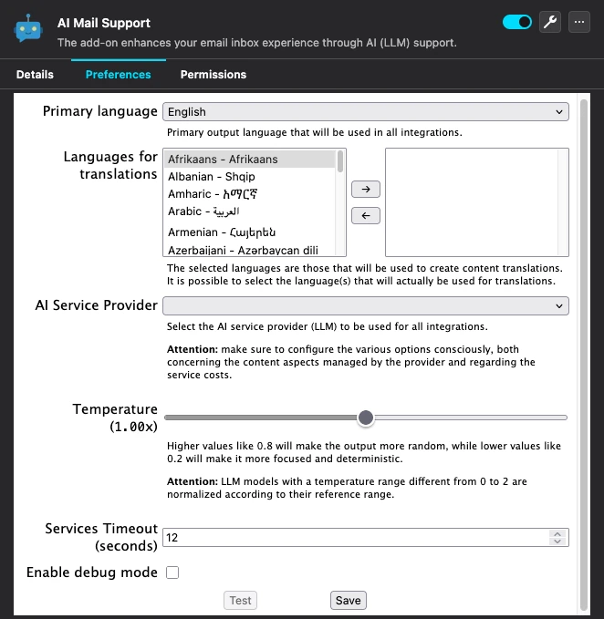
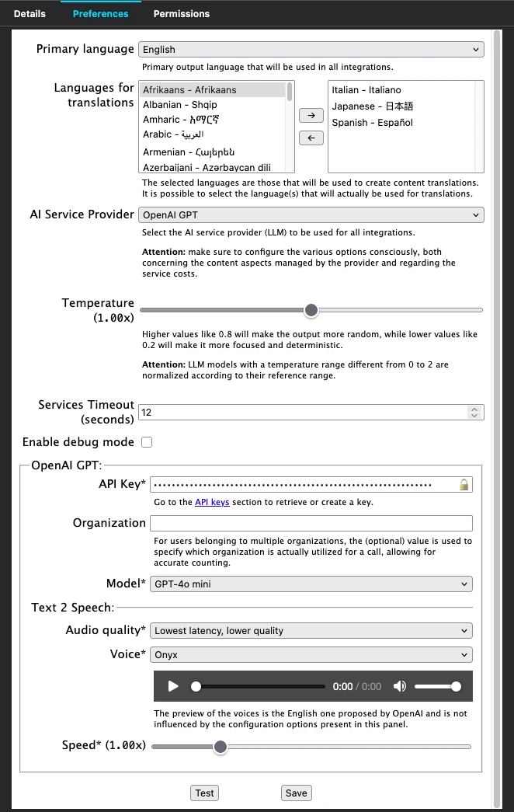
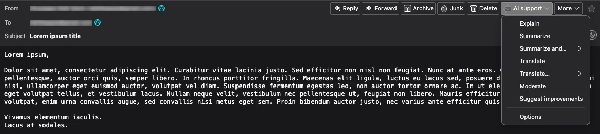

# AI Mail Support for Thunderbird

[](https://opensource.org/licenses/MIT)
[](https://www.typescriptlang.org)
[](https://www.thunderbird.net)


Thunderbird add-on designed to enhance both professional and personal email management.  
This add-on integrates a range of AI (LLM) features to streamline your inbox experience.

Our aim is to assist users dealing with high volumes of daily emails, providing tools for tasks like summarizing messages, translating content, offering structured support for composing responses, and much more.

## Contents

1. [Getting started](#getting-started)
   - [Settings and usage](#settings-and-usage)
   - [Owl for Exchange bug](#owl-for-exchange-bug)
2. [Build](#build)
3. [Permissions details](#permissions-details)
4. [Localization](#localization)
5. [License and references](#license-and-references)

## Getting started

Have you ever had an inbox full of hundreds of unread emails that you need to respond to?  
We have, and more than once.

That's why we decided to create this add-on for Thunderbird to help manage the multitude of emails we read daily as part of our work activities.

Several LLMs (Large Language Models) are integrated to provide a range of options for advanced text management, operating at the deepest possible semantic level, to optimize the management of your email inbox.  
The LLMs* currently supported are:

* Claude by [Anthropic](https://www.anthropic.com);
* DeepSeek by [Hangzhou DeepSeek Artificial Intelligence Basic Technology Research](https://www.deepseek.com);
* Gemini by [Google](https://ai.google.dev);
* GPT by [OpenAI](https://openai.com);
* Grok by [xAI](https://x.ai);
* Mistral by [Mistral AI](https://mistral.ai).

It is possible to access a wider set of models (e.g., Llama, Phi, Mistral, Gemma, and many others) through the use of:

* [Groq Cloud*](https://groq.com);
* [LM Studio](https://lmstudio.ai);
* [Ollama](https://ollama.com).

\* To use them, it is necessary to create an account on the respective platforms and enable an API access key. <u>Usage fees apply</u>; for more details, please refer to the respective websites.

**ATTENTION 1**: The services offered by Groq Cloud and Mistral AI include the option to use a free plan, albeit with low rate limits on requests.  
**ATTENTION 2**: Unlike other LLM models, LM Studio and Ollama allow you to run open-source models directly on your own PC, with no additional costs and maximum privacy, as everything is executed locally.  
The downside is that this requires *SIGNIFICANT* hardware resources.

### Settings and usage

After installing the add-on, you can configure the desired LLM service provider from the add-on's settings.

You can access the settings by going to `Tools → Add-ons and Themes`, and then selecting the wrench icon next to AI Mail Support.

<p align="center" width="100%"></p>

Based on the LLM choice, additional specific options will become available. For example, below is the screenshot of all possible configurations when OpenAI is selected as the provider.

<p align="center" width="100%"></p>

Typically, an authentication key needs to be configured; the specific method depends on the LLM provider.  
In the options, there will be a quick link to the official website with useful details.

Once the add-on is configured, you can interact with the AI management features within Thunderbird in three different locations:

1. In the email view, via the "AI support" menu:

<p align="center" width="100%"></p>

2. In the email composition or editing window, by selecting "AI support" in the top right:

<p align="center" width="100%"></p>

3. By selecting any text in either the email viewing or composition window, in the "AI Mail Support" section of the context menu:

<p align="center" width="100%"></p>

Regardless of how a request for processing is made, the output (audio or text) will be displayed in a dedicated pop-up at the bottom of the mail client.

<p align="center" width="100%"></p>

Whether in the email viewing or composition window, you can always enable the custom prompt feature to receive even more relevant responses tailored to your needs.

<p align="center" width="100%"></p>

### Owl for Exchange bug

If you use the [Owl for Exchange](https://addons.thunderbird.net/en-us/thunderbird/addon/owl-for-exchange) add-on to manage Exchange or Office365 accounts, ⚠️ **there is a known bug** that interferes with the [scripting.messageDisplay API](https://webextension-api.thunderbird.net/en/stable/scripting.messageDisplay.html) and will prevent AI Mail Support for Thunderbird from functioning correctly when previewing an email.

## Build

Run the following to build the add-on directly from the source code:

```console
$ git clone https://github.com/YellowSakura/aimailsupport.git
$ cd aimailsupport
$ npm install
```

To compile a development version of the add-on and install it in Thunderbird via `Tools → Developer Tools → Debug Add-ons → Load Temporary Add-on…`, use the following command:

```console
$ npm run build
```

To generate a file named ai-mail-support.xpi in the project's root folder, as a package ready for installation as an add-on in Thunderbird, use the following command:

```console
$ npm run build:package
```

To assess the overall quality of the code, you can use the following command:

```console
$ npm run lint
```

It is possible to run unit tests using the command:

```console
$ npm run test
```

You can run a specific group of tests for a single provider using the command:

```console
$ npm run test:single "AnthropicClaudeProvider"
```

Before running any tests, you need to create an `.env` file in the project root directory with the keys for the various LLM services in the following format:

```
anthropic_api_key = KEY_VALUE
deepseek_api_key = KEY_VALUE
google_api_key = KEY_VALUE
groq_api_key = KEY_VALUE
mistral_api_key = KEY_VALUE
openai_api_key = KEY_VALUE
xai_api_key = KEY_VALUE
```

To test LM Studio, it is necessary to install the model ```llama-3.2-1b``` from the GUI or using the command:

```console
$ lms get llama-3.2-1b
```

To test Ollama, it is necessary to install the model ```llama3.2:1b``` using the command:

```console
$ ollama pull llama3.2:1b
```

## Permissions details

AI Mail Support for Thunderbird aims to make use of a minimal set of permissions for its operation, specifically:

- accountsRead: See your mail accounts, their identities, and their folders.  
  Used to identify the presence of any accounts managed by the [Owl for Exchange](https://addons.thunderbird.net/en-us/thunderbird/addon/owl-for-exchange) add-on and display a malfunction warning as indicated in the [Owl for Exchange bug section](#owl-for-exchange-bug), see https://webextension-api.thunderbird.net/en/latest/accounts.html#permissions.
- compose: Read and modify your email messages as you compose and send them.  
  Used to interact with the email composition window (replying or creating a new email), see https://webextension-api.thunderbird.net/en/latest/compose.html#permissions.
- menus: Required to use `messenger.menus.*` functions.  
  Used to create custom menus, see https://webextension-api.thunderbird.net/en/latest/menus.html#permissions.
- messagesRead: Read your email messages.  
  Used to read the content of an existing email in the viewing window, see https://webextension-api.thunderbird.net/en/latest/messages.html#permissions.
- messagesModify: Read and modify your email messages as they are displayed to you.  
  Used to modify the content of an existing email in the viewing window, see https://webextension-api.thunderbird.net/en/latest/messageDisplayScripts.html#permissions.
- sensitiveDataUpload: Email content is sent to the selected LLM service provider for processing, based on your choices in the add-on's settings.
- storage: Enables the add-on to store and retrieve data, and listen for changes to stored items.  
  Used to store user settings, see https://developer.mozilla.org/en-US/docs/Mozilla/Add-ons/WebExtensions/API/storage.

## Localization

The add-on has a small set of messages that require localization. If you want to extend the translation, the process is straightforward:

1. Copy the file `src/locales/en-messages.json` to `src/locales/%ISO_CODE%-messages.json`, where `%ISO_CODE%` is your [ISO 639-1](https://en.wikipedia.org/wiki/List_of_ISO_639-1_codes) language code.
2. Translate your `src/locales/%ISO_CODE%-messages.json`, specifically the `message` properties, and remove the `description` properties, which are only used for context.
3. Add a new line in the `package.json` file, matching the other `build:locales-*` entries and keeping them in alphabetical order:

   ```json
   "build:locales-%ISO_CODE%": "node_modules/.bin/json-minify src/locales/%ISO_CODE%-messages.json > ai-mail-support/_locales/%ISO_CODE%/messages.json",
   ```
4. Add a corresponding entry to the `build:locales` script in `package.json`, again maintaining alphabetical order.
5. Add the folder `%ISO_CODE%` to the `_locales` key in your `src/manifest.json`.
6. Test your changes using the build process described in the [Build section](#build) and submit the changes in a pull request.

## License and references

The code is licensed under the [MIT](https://opensource.org/licenses/MIT) by [Yellow Sakura](https://www.yellowsakura.com), [support@yellowsakura.com](mailto:support@yellowsakura.com), see the LICENSE file.  
For more details, please refer to the [project page](https://www.yellowsakura.com/en/projects/ai-mail-support-for-thunderbird) and the link to the [official AMO (addons.mozilla.org) page](https://addons.thunderbird.net/en-GB/thunderbird/addon/ai-mail-support).

Dependencies:

* [ESLint](https://github.com/eslint/eslint) is licensed under [MIT License](https://opensource.org/licenses/MIT);
* [parcel](https://github.com/parcel-bundler/parcel) is licensed under [MIT License](https://opensource.org/licenses/MIT);
* [posthtml](https://github.com/posthtml/posthtml) is licensed under [MIT License](https://opensource.org/licenses/MIT);
* [remove-markdown](https://github.com/zuchka/remove-markdown) is licensed under [MIT License](https://opensource.org/licenses/MIT);
* [types/sanitize-html](https://github.com/apostrophecms/sanitize-html) is licensed under [MIT License](https://opensource.org/licenses/MIT);
* [types/thunderbird-webext-browser](https://www.npmjs.com/package/@types/thunderbird-webext-browser) is licensed under [MIT License](https://opensource.org/licenses/MIT);
* [typescript-eslint/parser](https://github.com/typescript-eslint/typescript-eslint) is licensed under [BSD 2-clause license](https://opensource.org/license/bsd-2-clause).

Images:

* Robots logo icons in `docs/bot-icon-*` were created by [Smashicons - Freepik](https://www.freepik.com/icon/bot_4712106)

---

All trademarks mentioned are the property of their respective owners.